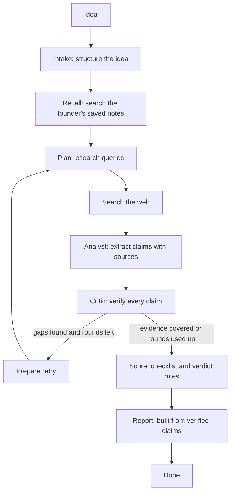
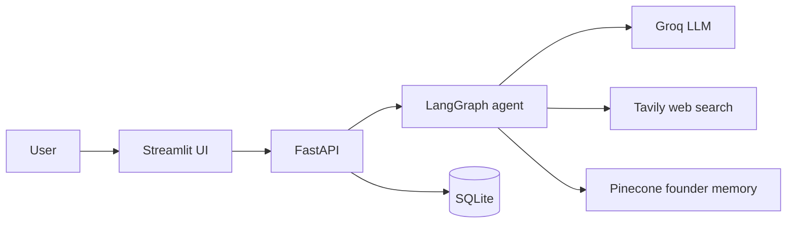

# Startup Validator


**Validate your idea before you build it.** Describe a startup idea, and a team of AI agents researches
competitors and the market, checks every claim against its source, and returns a verdict decided by
fixed rules. When the evidence is weak, the report says so instead of guessing.


## Why it exists

Early-stage founders spend days on competitor and market research, and language models make it easy to
produce confident, wrong answers. This project is built around one idea: **an AI report is only useful if
every claim in it can be traced to a real source, and the verdict does not depend on the model's mood.**

## How it works



1. **Intake** turns the idea into a structured profile (problem, customer, solution, geography).
2. **Recall** searches the founder's own saved notes in Pinecone, so past decisions can influence the result.
3. **Researcher** plans one search per angle (competitors, pricing, market size, demand, recent activity, failures) and searches the web with Tavily.
4. **Analyst** extracts factual claims, each tied to the sources that state it.
5. **Critic** verifies every claim (below). Failed claims are removed, and the reason is saved.
6. If an angle still lacks verified evidence, the critic sends the work **back to the researcher** with the list of gaps (at most 2 extra rounds).
7. **Scoring** applies a fixed 8-item checklist and fixed verdict rules. No language model decides the verdict.
8. **Reporter** builds the report from verified claims only. Citations and the source list are built in code.

### The critic

Each claim goes through six checks and is dropped at the first failure:

| # | Check | Done by |
|---|---|---|
| 1 | The claim cites a source that exists | Code |
| 2 | Every number in the claim appears in the cited source text | Code |
| 3 | Every company or product name appears in the cited source text | Code |
| 4 | An LLM judges whether the source supports the claim and must return an exact quote | LLM |
| 5 | The quote is checked to be a real passage of the source | Code |
| 6 | The claim is relevant evidence for this idea, and its category is right | LLM, plus a code rule that market-size claims must talk about a market |

### Verdict rules

| Condition | Verdict |
|---|---|
| Fewer than 4 of 8 checklist items verified | Unclear: not enough verified evidence |
| 7 or more verified competitors and no differentiation gap | Risky |
| Verified differentiation gap, verified demand, market not crowded, no conflict with the founder's notes | Promising |
| Anything else | Proceed with caution (the report names what blocks "Promising") |

The checklist: competitors found, pricing for those competitors, customer demand, market size, recent activity,
a documented risk, a differentiation gap, and the founder's notes checked.

## Architecture



| Part | Technology |
|---|---|
| Agent workflow | LangGraph |
| LLM | Groq (`openai/gpt-oss-120b`), through LangChain |
| Web research | Tavily |
| Memory | Pinecone (hosted `llama-text-embed-v2` embeddings) |
| API | FastAPI, background runs, live event log |
| Storage | SQLite |
| Interface | Streamlit (a React redesign is planned) |
| Quality | pytest (89 tests), GitHub Actions |
| Deployment | Docker, Render |

## Evaluation

I measured the critic on **26 hand-written claim and source pairs** (`tests/eval/critic_cases.json`): 15 claims that
must be rejected and 11 that must be kept. The sources and companies are invented, so the correct answer for each case
is known.

| Run | Overall | Bad claims caught | Good claims kept | Code-rule cases | LLM-judgement cases |
|---|---|---|---|---|---|
| `gpt-oss-20b` | 22/26 (85%) | 13/15 | 9/11 | 9/9 | 13/17 |
| `gpt-oss-120b` | **TBD**/26 | **TBD**/15 | **TBD**/11 | **TBD**/9 | **TBD**/17 |

What the evaluation found:

- **The code rules are reliable.** Invented prices, invented market figures, wrong company names, missing or non-existent sources, and made-up quotes from notes were caught every time.
- **The language-model judgement is the weak spot.** On `gpt-oss-20b`, two true-but-irrelevant claims (funding of a corporate-training company, and a general video-call tool as a "competitor") were accepted, and two good claims were wrongly removed (one from a source with spacing noise, one with the wrong category label).
- I wrote the cases before tuning anything. Any later prompt change is noted here.

Reproduce:
```bash
python tests/eval/run_critic_eval.py --rules-only   # free, no API calls
python tests/eval/run_critic_eval.py                # full run, uses the LLM
```

A second harness, `tests/eval/run_verdict_eval.py`, runs the whole agent on 9 ideas (crowded markets, niche ideas, vague
ideas) with their own database and an empty memory. It is resumable, because a free Groq key allows only a couple of full runs a day.
**TBD: add your results here, or delete this paragraph and list it under "Next steps".**

## Run it yourself

Requirements: Python 3.13 and free keys for [Groq](https://console.groq.com), [Tavily](https://tavily.com) and
[Pinecone](https://www.pinecone.io).

```bash
git clone https://github.com/Jagruti2004deore/startup-validator.git
cd startup-validator
python -m venv venv
venv\Scripts\activate          # Windows. On macOS or Linux: source venv/bin/activate
pip install -r requirements-dev.txt
cp .env.example .env           # then add your keys (copy .env.example .env on Windows)
```

Start the API and the interface in two terminals:
```bash
uvicorn app.api:app --port 8000
streamlit run ui/streamlit_app.py
```
API documentation: http://127.0.0.1:8000/docs

Or with Docker:
```bash
docker compose up --build
```

Run the tests (no API calls, no tokens):
```bash
python -m pytest -q
```

### Configuration

| Variable | Purpose | Default |
|---|---|---|
| `GROQ_API_KEY`, `TAVILY_API_KEY`, `PINECONE_API_KEY` | Required | none |
| `MODEL_NAME` | Groq model | `openai/gpt-oss-120b` |
| `PINECONE_NAMESPACE` | Separates one memory from another | `founder` |
| `DB_PATH` | SQLite file location | `validator.db` |
| `APP_API_KEY` | If set, every request must send it in the `X-API-Key` header | off |
| `MAX_RUNS_PER_DAY` | Daily validation budget | `20` |
| `ALLOWED_ORIGINS` | Allowed browser origins | localhost |
| `API_URL` | Where the interface finds the API | `http://127.0.0.1:8000` |

### API

| Endpoint | Purpose |
|---|---|
| `POST /validate` | Start a validation in the background |
| `GET /runs/{id}?after=N` | Status, verdict, and live events since event N |
| `GET /runs/{id}/report` | Report, verified claims, removed claims, sources |
| `GET /runs` | History |
| `POST /notes`, `GET /notes` | Save and list founder notes (the agent's memory) |
| `GET /health` | Health check |

## Production safeguards

- API-key authentication and a daily validation budget, so a public deployment cannot drain the LLM quota
- One validation at a time, and runs left unfinished by a crash are marked failed at startup
- Separate handling for per-minute rate limits (wait and retry) and the daily token limit (stop with a clear message)
- A capped research loop (2 extra rounds) and capped source counts
- Structured LLM output validated with Pydantic, with automatic retries on malformed JSON
- 89 automated tests run in GitHub Actions on every push

## Design decisions

- **The verdict comes from rules, not the model.** The same evidence always gives the same verdict, and the report shows which rule applied.
- **Code first, model second.** Cheap deterministic checks run before any LLM check. The LLM must quote the source, and code verifies the quote.
- **Citations and the source list are built in code.** Earlier, the model copied titles wrongly.
- **Honest failure.** Obscure ideas end as "Unclear" with a list of what could not be verified, instead of a confident guess.
- **Pricing must name a verified competitor.** This rule was added after the first full runs attached an app's prices to a different company that shared part of its name.

## Limitations

- The agent reads search-result snippets, not full web pages, so details can be missing.
- Relevance judgement by the language model is imperfect (see the evaluation). The competitor count includes only verified competitors, so a market can be more crowded than reported.
- Competitor names are matched by simple rules, so very similar names can still collide.
- The verdict thresholds are a first design and have been tested on a small, hand-labelled set. The verdict is decision support, not a prediction of success.
- The free Groq tier allows only a couple of full validations a day. The live demo may report that the daily limit is reached.
- On Render's free tier the service sleeps when idle (the first request can take about a minute), and the SQLite data resets on restart. Pinecone memory persists.

## Live demo

The API is deployed on Render's free tier and protected by an API key, to protect a small free AI quota.
A recorded demo and a real example report are provided instead: see [`docs/example_report.md`](docs/example_report.md).

**TBD: add a link to a short demo video or GIF, or remove this line.**

## Project structure

```
startup-validator/
├── app/
│   ├── agents/          intake, researcher, analyst, critic, reporter
│   ├── api.py           FastAPI endpoints
│   ├── graph.py         LangGraph wiring and the critic-to-researcher loop
│   ├── scoring.py       checklist and verdict rules (no LLM)
│   ├── memory.py        Pinecone founder memory
│   ├── db.py            SQLite storage
│   ├── llm_utils.py     structured output, rate-limit and daily-quota handling
│   └── models.py, state.py, prompts.py, config.py, utils.py
├── ui/                  Streamlit interface
├── tests/               unit tests and the evaluation harness (tests/eval)
├── docs/                example report
├── Dockerfile, docker-compose.yml, .github/workflows/tests.yml
└── requirements.txt, requirements-dev.txt
```

## Next steps

- A production-quality React interface for the same API
- A stricter second relevance check, to address the weaknesses found in the evaluation
- Reading full pages for the strongest sources
- Verdict evaluation on a larger set of ideas, and a comparison of models